# Domora

Domora ist ein WG-Organizer als Web-App (PWA) mit Supabase-Backend.

- Frontend: React + TypeScript + Vite
- Backend: Supabase (Auth, Postgres, RLS, RPC)
- Mobile: Capacitor (Android)

## Inhalt

- [Domora](#domora)
  - [Inhalt](#inhalt)
  - [Highlights](#highlights)
    - [Auth und Haushalte](#auth-und-haushalte)
    - [Home](#home)
    - [Shopping](#shopping)
    - [Tasks](#tasks)
    - [Finanzen](#finanzen)
  - [Settings](#settings)
  - [Screenshots](#screenshots)
  - [Tech Stack](#tech-stack)
  - [Projektstruktur](#projektstruktur)
  - [Voraussetzungen](#voraussetzungen)
  - [Quickstart](#quickstart)
  - [Konfiguration](#konfiguration)
    - [`.env` Variablen](#env-variablen)
    - [Supabase Setup (separat)](#supabase-setup-separat)
    - [Supabase Edge Functions (Push)](#supabase-edge-functions-push)
  - [Datenbank und Security](#datenbank-und-security)
    - [Wichtige Security-Mechanismen](#wichtige-security-mechanismen)
    - [Performance-Hinweise im Schema](#performance-hinweise-im-schema)
  - [Entwicklung](#entwicklung)
    - [Wichtige Skripte](#wichtige-skripte)
    - [i18n](#i18n)
  - [Tests und Qualitaet](#tests-und-qualitaet)
  - [Dummy-Daten](#dummy-daten)
  - [PWA](#pwa)
  - [Android (Capacitor)](#android-capacitor)
  - [Deployment und CI/CD](#deployment-und-cicd)
  - [Troubleshooting](#troubleshooting)
    - ["Supabase nicht konfiguriert"](#supabase-nicht-konfiguriert)
    - [Join funktioniert nicht](#join-funktioniert-nicht)
    - [Schema-Update greift nicht](#schema-update-greift-nicht)
    - [Push/OCR funktionieren nicht](#pushocr-funktionieren-nicht)

## Highlights

### Auth und Haushalte

- E-Mail/Passwort Login via Supabase Auth
- Optionaler Google Sign-in
- Haushalt erstellen
- Join nur ueber Invite-Code/RPC-Flow (`join_household_by_invite`)
- Mehrere Haushalte pro User

### Home

- Dashboard mit Kennzahlen
- Activity Feed
- Landing Page pro Haushalt (Markdown)
- Landing Widgets
- Bucket List inkl. Checkliste, Vorschlagsdaten und Voting

### Shopping

- Einkaufsliste mit Tags
- Wiederholung (`days|weeks|months`)
- Historie abgeschlossener Items
- Trends/Charts

### Tasks

- Rotationsbasierte Aufgaben
- Frequenz, Startdatum, Pimpers, Fairness-Modi (`actual|projection`)
- Vacation Mode pro Mitglied
- Aufgaben-Statistiken und Kalender
- Task-Historie mit 5-Sterne-Bewertung
  - keine Selbstbewertung
  - nur letzter Completion-Eintrag einer Aufgabe ist bewertbar
- Optionales Bild fuer Ist-/Soll-Zustand
- Push-Erinnerungen (Browser)

### Finanzen

- Eintraege mit Kategorie, Zeitraum, Beteiligten
- Historie mit Filtern und Charts
- Stacked Bars pro Mitglied
- Saldo und Settlement-Vorschlaege
- Abos/Vertraege
- OCR/Kamera-Flow fuer Belege
- Kassensturz-Requests

### Settings

- Theme (`system|light|dark`)
- Sprache (`de|en`)
- Profil (Name, Avatar, Farbe)
- Payment Handles (PayPal, Revolut, Wero)
- Haushaltseinstellungen (Adresse, Waehrung, Miete, Flaechen)
- Mieterverwaltung inkl. Rollen

## Screenshots

| Screenshot | Screenshot | Screenshot | Screenshot |
| --- | --- | --- | --- |
| 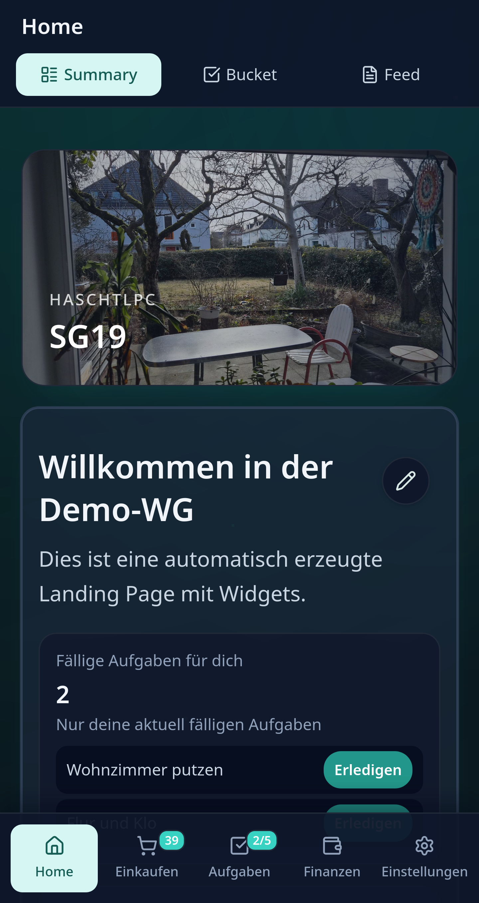 | 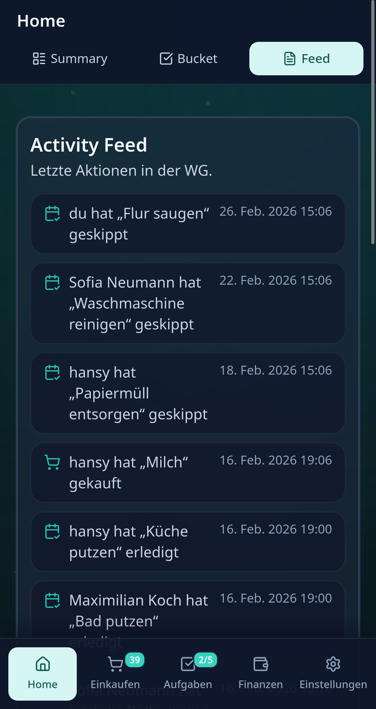 | 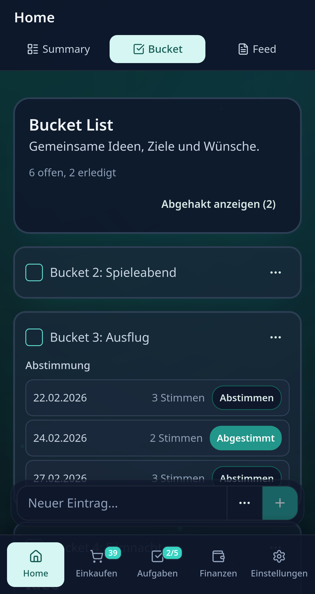 | 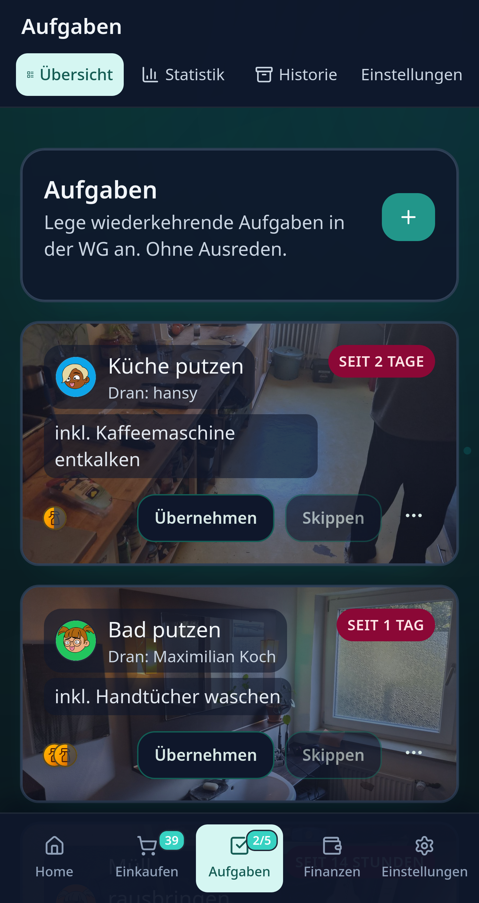 |
| 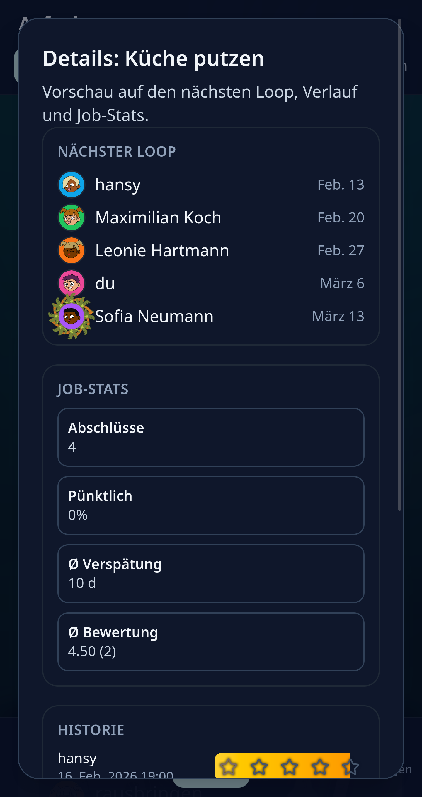 | 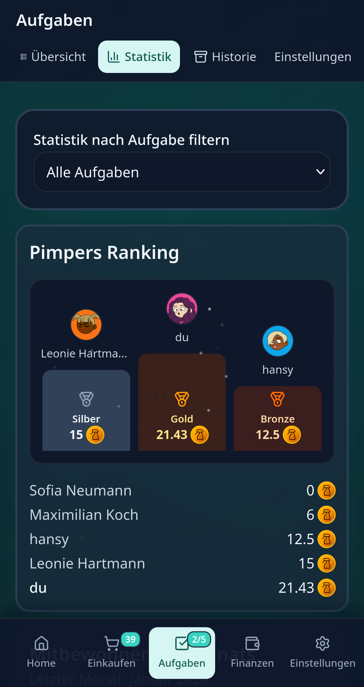 | 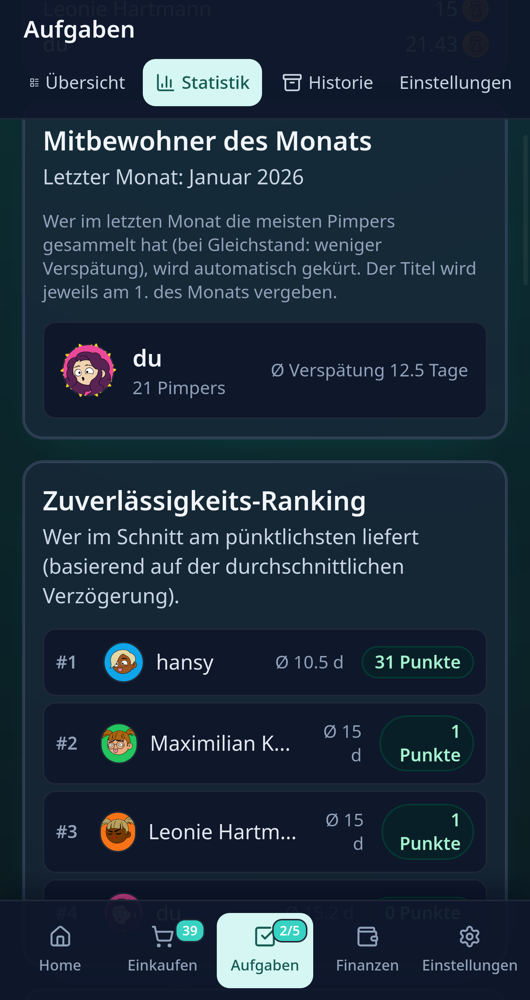 | 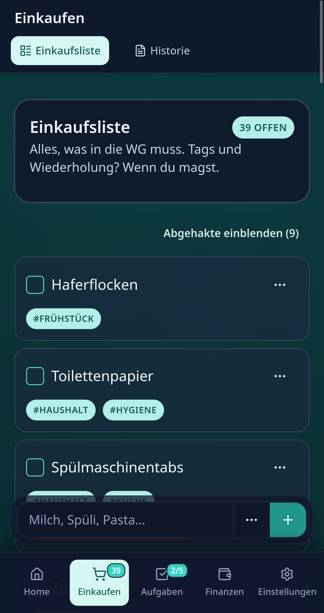 |
| 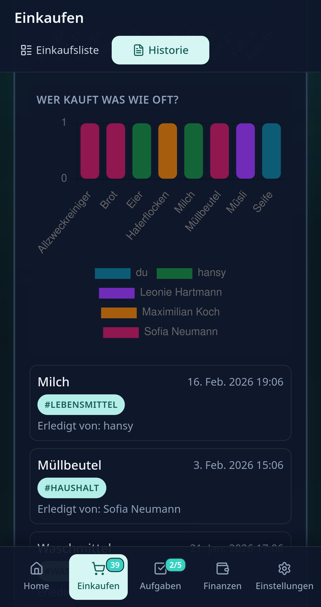 | 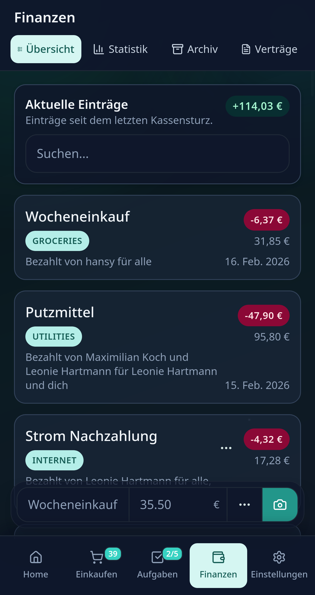 | 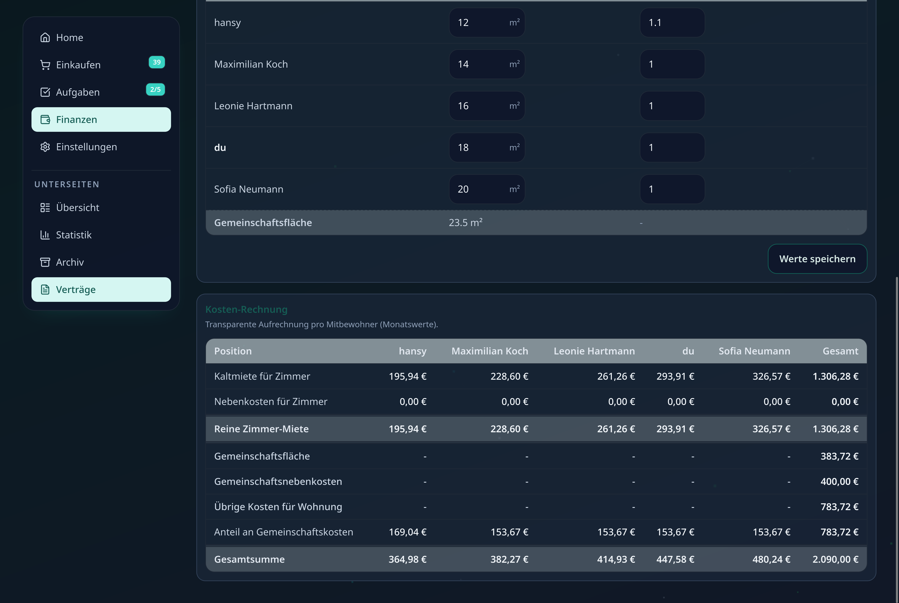 | 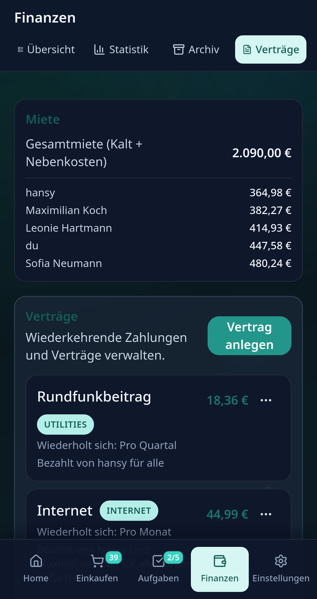 |
| 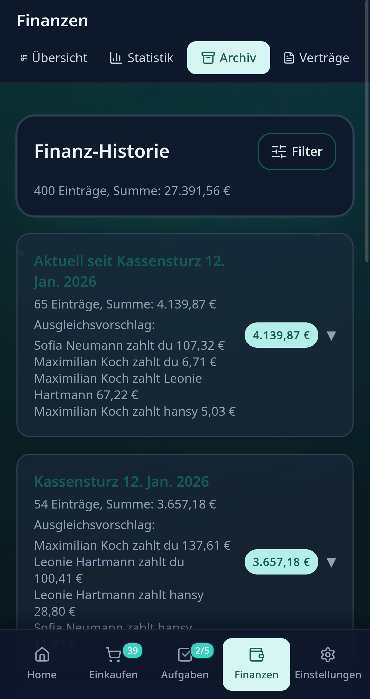 | 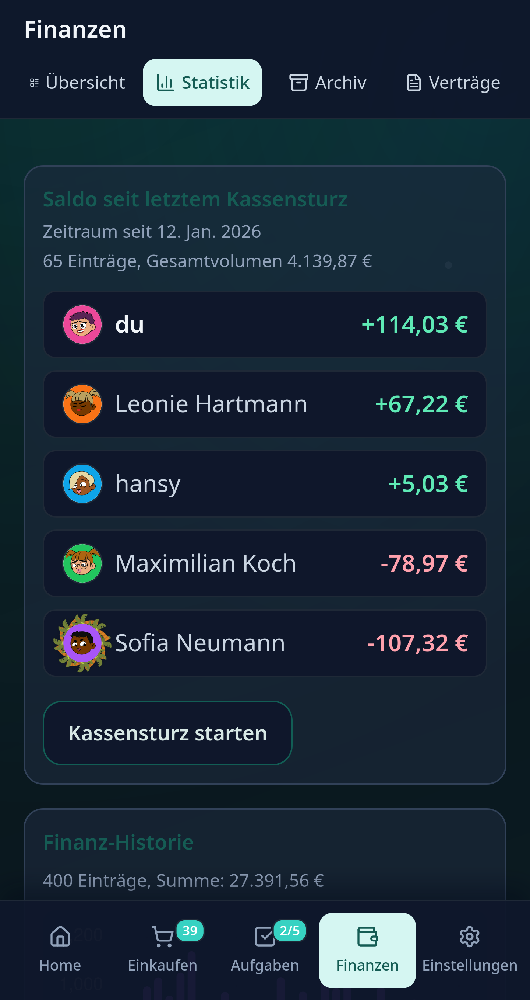 | 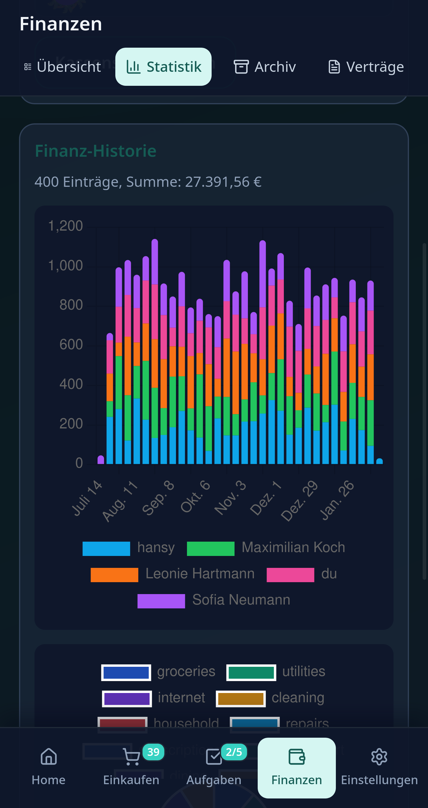 | 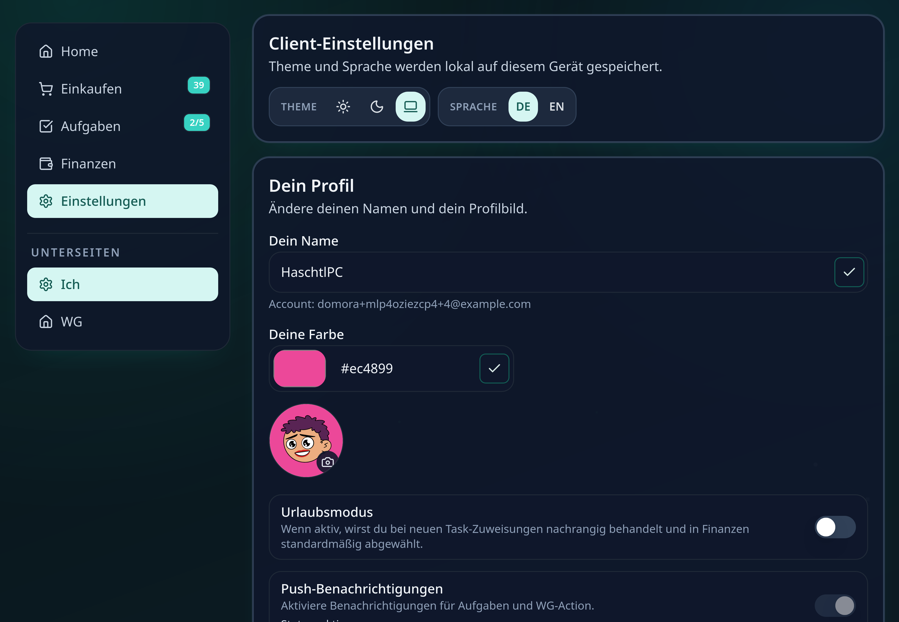 |
| 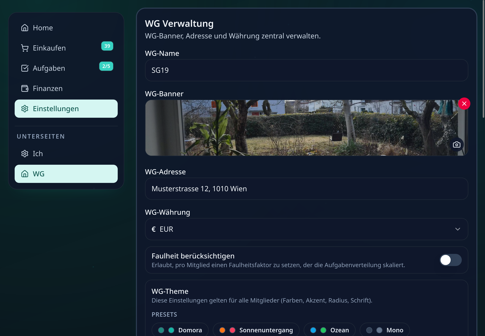 |  |  |  |

### Google Play Screenshot Automation

Der komplette Play-Store-Screenshot-Flow ist automatisiert (inkl. voller Screen-Palette):

- Home: Summary, Feed, Bucket
- Tasks: Overview, Details, Stats 1, Stats 2
- Shopping: List, History
- Finances: Overview, Rent, Contracts, Archive, Stats 1, Stats 2
- Settings: Me, Household

Generierte Formate:

- `phone`: `1080x1920`
- `tablet-7`: `1200x1920`
- `tablet-10`: `1600x2560`

Die Auflösungen liegen innerhalb der Google-Play-Grenzen (min. 320 px, max. 3840 px pro Seite, Seitenverhältnis <= 2:1).

Ausgabeordner:

- Standard: `screenshots/google-play/`
- Optional anpassbar über `PLAYSTORE_SCREENSHOT_DIR`

Direkt mit vorhandenen Login-Daten:

```bash
PLAYSTORE_SCREENSHOT_EMAIL=... PLAYSTORE_SCREENSHOT_PASSWORD=... pnpm screenshots:playstore
```

Alternativ in `.env`/`.env.local` setzen und dann normal `pnpm screenshots:playstore` starten.

Das Screenshot-Skript verändert keine Daten in Supabase und führt keinen Seed aus.

## Tech Stack

- React 19
- TypeScript 5
- Vite 7
- TanStack Query / Store / Form / Router
- Tailwind CSS 4
- Radix UI primitives
- Framer Motion
- Chart.js + react-chartjs-2
- Supabase JS v2
- Zod
- Vitest + Playwright

Siehe auch `package.json` fuer exakte Versionen und Skripte.

## Projektstruktur

```text
src/
  components/           UI-Bausteine
  features/tabs/        Home, Shopping, Tasks, Finances, Settings
  hooks/                Workspace- und Feature-Hooks
  lib/                  API-Client, Types, Helpers, i18n, Store
  App.tsx               Shell + Navigation + Routing
supabase/
  schema.sql            Vollstaendiges DB-Schema inkl. RLS, Funktionen, Trigger
scripts/
  seed-dummy.mjs        Demo-Daten-Generator
tests/                  Playwright E2E
```

## Voraussetzungen

- Node.js 20+
- pnpm 10+ (empfohlen)
- Supabase Projekt

Optional:
- Android Studio (fuer Android Build)

## Quickstart

1. Abhaengigkeiten installieren:

```bash
pnpm install
```

2. Environment vorbereiten:

```bash
cp .env.example .env
```

3. Mindestens folgende Variablen in `.env` setzen:

- `VITE_SUPABASE_URL`
- `VITE_SUPABASE_PUBLISHABLE_KEY`

4. DB-Schema anwenden:

- `supabase/schema.sql` im Supabase SQL Editor ausfuehren
- bei Updates: das aktuelle `schema.sql` erneut ausfuehren (enthaelt idempotente `if not exists`/Upgrade-Bloecke)

5. App starten:

```bash
pnpm dev
```

## Konfiguration

### `.env` Variablen

Frontend:

- `VITE_SUPABASE_URL`
- `VITE_SUPABASE_PUBLISHABLE_KEY`

Seed/Serverseitig:

- `SUPABASE_URL`
- `SUPABASE_SECRET_KEY`

Wichtig:

- `SUPABASE_SECRET_KEY` niemals als `VITE_*` exponieren.

### Supabase Setup (separat)

Ausfuehrliche Schritt-fuer-Schritt Anleitung inkl. kompletter `supabase secrets set` Befehle:

- [`supabase/README.md`](supabase/README.md)

### Supabase Edge Functions (Push)

Die Push-Pipeline laeuft ueber Supabase Edge Functions (`dispatch-push-jobs`, `schedule-task-due`, `schedule-member-of-month`) und benoetigt eigene Secrets.
Der Web-Client laedt die Firebase-Clientkonfiguration zur Laufzeit ueber `firebase-public-config` vom jeweils aktiven Supabase-Backend.

In Supabase **Project Settings → Functions → Secrets** setzen:

- `SUPABASE_URL`
- `SUPABASE_SERVICE_ROLE_KEY`
- `SUPABASE_ANON_KEY`
- `FCM_PROJECT_ID`
- `FCM_SERVICE_ACCOUNT_JSON` (voller JSON-String des Firebase Service Accounts)
- `CRON_SECRET` (muss dem DB-Cron-Secret entsprechen, siehe unten)
- `FIREBASE_WEB_CONFIG_JSON` (empfohlen: kompletter JSON-Block inkl. `firebase` + `vapidKey`)

Alternativ statt `FIREBASE_WEB_CONFIG_JSON`:

- `FIREBASE_WEB_API_KEY`
- `FIREBASE_WEB_AUTH_DOMAIN`
- `FIREBASE_WEB_PROJECT_ID`
- `FIREBASE_WEB_MESSAGING_SENDER_ID`
- `FIREBASE_WEB_APP_ID`
- `FIREBASE_WEB_VAPID_KEY`
- optional: `FIREBASE_WEB_STORAGE_BUCKET`, `FIREBASE_WEB_MEASUREMENT_ID`

Optional fuer lokale Tests via CLI:

```bash
supabase secrets set \
  --project-ref <YOUR_PROJECT_REF> \
  SUPABASE_URL=... \
  SUPABASE_SERVICE_ROLE_KEY=... \
  SUPABASE_ANON_KEY=... \
  FCM_PROJECT_ID=... \
  FCM_SERVICE_ACCOUNT_JSON='{"type":"service_account",...}' \
  CRON_SECRET=... \
  FIREBASE_WEB_CONFIG_JSON='{"firebase":{"apiKey":"...","authDomain":"...","projectId":"...","messagingSenderId":"...","appId":"..."},"vapidKey":"..."}'
```

Deployment:

```bash
supabase functions deploy dispatch-push-jobs --project-ref <YOUR_PROJECT_REF>
supabase functions deploy schedule-task-due --project-ref <YOUR_PROJECT_REF>
supabase functions deploy register-push-token --project-ref <YOUR_PROJECT_REF>
supabase functions deploy schedule-member-of-month --project-ref <YOUR_PROJECT_REF>
supabase functions deploy firebase-public-config --project-ref <YOUR_PROJECT_REF>
```

Alle Functions auf einmal (über das Projekt-Skript):

```bash
SUPABASE_PROJECT_REF=<YOUR_PROJECT_REF> pnpm supabase:functions:deploy:all
```

Scheduler/Cron:

- In `supabase/schema.sql` ist ein Cron-Block enthalten (pg_cron + pg_net erforderlich).
- Der Scheduler ruft `dispatch-push-jobs` regelmaessig, `schedule-task-due` taeglich und `schedule-member-of-month` monatlich auf.
- Das Cron-Secret kommt bevorzugt aus Vault `domora_cron_secret`, alternativ aus `app.supabase_cron_secret`.
- Edge Functions pruefen `x-cron-secret` gegen `CRON_SECRET`.
- Wichtig: `net.http_post(url, body, params, headers, timeout)` (Headers sind der 4. Parameter).

Hinweis: Der Web-Client benoetigt keine `VITE_FIREBASE_*` Variablen mehr. Die Firebase-Clientkonfiguration kommt vom aktiven Backend ueber die Edge Function `firebase-public-config`.

Edge Functions Auth:

- `dispatch-push-jobs` wird per Cron ohne JWT aufgerufen, daher in der Function-Konfiguration `verify_jwt = false` setzen.

## Datenbank und Security

Die zentrale Logik liegt in `supabase/schema.sql`:

- Tabellen fuer Haushalte, Mitglieder, Shopping, Bucket, Tasks, Finanzen
- RLS auf allen relevanten Tabellen
- RPC-Funktionen fuer geschaeftskritische Aktionen (z. B. Task Complete/Skip, Join via Invite)
- Trigger/Guards fuer Sicherheitsregeln

### Wichtige Security-Mechanismen

- Join in `household_members` ist auf Invite-RPC-Flow verlagert (`join_household_by_invite`)
- Rollenwechsel wird zusaetzlich per Trigger abgesichert (`guard_household_member_role_change`)
- Haushaltswartung (`run_household_data_maintenance`) erzwingt Owner-Rechte fuer normale User
- Bewertungen in Task-Historie werden serverseitig validiert (`rate_task_completion`)

### Performance-Hinweise im Schema

- mehrere zusammengesetzte Indizes fuer RLS- und Historien-Queries
- optimierte Berechnung in Task-Assignee-Logik (`choose_next_task_assignee`)

## Entwicklung

### Wichtige Skripte

```bash
pnpm dev
pnpm build
pnpm preview
pnpm typecheck
pnpm lint
pnpm lint:fix
```

Falls pnpm lokal nicht verfuegbar ist, funktionieren viele Kommandos auch mit `npm run <script>`.

### i18n

- Sprachen in `src/lib/translations.ts`
- aktuell: `de`, `en`

## Tests und Qualitaet

Unit Tests:

```bash
pnpm test:unit
pnpm test:unit:watch
```

E2E (Playwright):

```bash
pnpm test:e2e
pnpm test:e2e:ui
```

Alles zusammen:

```bash
pnpm test
```

Empfohlener lokaler Check vor PR:

```bash
pnpm lint && pnpm typecheck && pnpm test:unit
```

## Dummy-Daten

Schneller Demo-Seed:

1. In `.env` setzen:

- `SUPABASE_URL`
- `SUPABASE_SECRET_KEY`

2. Starten:

```bash
pnpm seed:dummy
```

Optionale Parameter:

- `DUMMY_MEMBER_COUNT` (Default `5`)
- `DUMMY_TASK_COUNT` (Default `14`)
- `DUMMY_FINANCE_COUNT` (Default `72`)
- `DUMMY_SHOPPING_COUNT` (Default `48`)
- `DUMMY_CASH_AUDIT_COUNT` (Default `5`)

Das Script loescht bestehende App-Daten und erzeugt danach konsistente Demo-Daten fuer:

- Demo-User (inkl. `user_profiles` mit `user_color` und Payment Handles)
- Haushalt inkl. `landing_page_markdown` mit Widget-Tokens
- Memberships inkl. Rollen, `task_laziness_factor` und `vacation_mode`
- Tasks inkl. Rotation, Completions, Pimpers und Ist-/Soll-Bild-URLs
- Task-Historie-Ratings (`task_completion_ratings`)
- Shopping inkl. Wiederholungen und Completion-Historie
- Bucket List inkl. Markdown-Beschreibung, Terminvorschlaegen und Votes
- Finanzeintraege, Subscriptions und Cash-Audit-Requests
- Household Events inkl. `task_completed`, `task_skipped`, `shopping_completed`, `finance_created`, `role_changed`

## PWA

- Registrierung ueber `vite-plugin-pwa`
- Manifest/Icons in `public/`
- Installierbar als Homescreen-App

## Android (Capacitor)

Vorbereitung:

```bash
pnpm install
```

Sync:

```bash
pnpm mobile:sync:android
```

Android Studio oeffnen:

```bash
pnpm mobile:open:android
```

Nuetzlich:

```bash
pnpm mobile:copy:android
pnpm mobile:sync:android
```

Bei Web-Aenderungen vor Android-Build immer neu syncen.

## Deployment und CI/CD

GitHub Actions (siehe `.github/workflows/`):

- CI: lint, typecheck, unit, e2e, build
- CD: Build auf `main` und Artefakt-Upload

## Troubleshooting

### "Supabase nicht konfiguriert"

- pruefen ob `VITE_SUPABASE_URL` und `VITE_SUPABASE_PUBLISHABLE_KEY` gesetzt sind
- Dev-Server nach `.env` Aenderungen neu starten

### Join funktioniert nicht

- Invite-Code validieren
- sicherstellen, dass `join_household_by_invite` im Schema deployed ist

### Schema-Update greift nicht

- aktuelles `supabase/schema.sql` erneut komplett ausfuehren
- bei Fehlern SQL-Reihenfolge und bestehende Constraints/Funktionen pruefen

### Push/OCR funktionieren nicht

- Browser-/Device-Permissions prüfen
- HTTPS/secure context verwenden
- nicht jeder Browser unterstuetzt alle Kamera/OCR-Pfade identisch
- Wenn im Client bei Push-Support `nicht konfiguriert` steht: `firebase-public-config` deployen und `FIREBASE_WEB_CONFIG_JSON` (oder `FIREBASE_WEB_*`) Secrets setzen.
- Wenn `dispatch-push-jobs` 401 liefert: `x-cron-secret` Header und `CRON_SECRET`/Vault `domora_cron_secret` pruefen, Function muss `verify_jwt = false` haben.
- Wenn `net._http_response` Timeouts zeigt, aber `push_jobs.pending` sinkt: Timeout erhoehen (z. B. 20000–30000 ms) oder Batch groesse in der Function reduzieren.
- `push_log` bleibt leer, wenn es keine aktiven Tokens gibt: `push_tokens` mit `status='active'` pruefen oder ob Empfaenger durch `push_preferences` (topics/quiet_hours/disabled) gefiltert werden.
